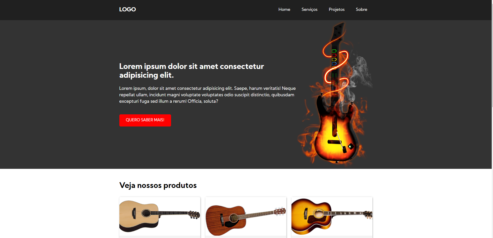

# HTML RESPONSIVO

Criação de um site totalmente responsivo para treinamento com `html`, `css` e um pouco de `javascript`.
Não espere uma obra de arte mas temos ai um site (parcialmente semantico rsrs) com alguns conceitos bem bacana de responsividade como:

- Display Grid com auto-fit
- Configuração global no html para responsividade nos textos
- Conceito de max-width para o template não ficar tão esticado em **big screens**
- Conceito de menu hamburger, com animação na transição de abertur e fechamento do menu.

As imagens foram retiradas do `google.com` então não utilizem comercialmente pois não sei se existe direitos nelas.

## QUER MELHORAR ESTE LAYOUT DE TREINO?

Então fique a vontade você com ou sem experiência que tem algo para acrescentar sobre o responsividade ficarei feliz em receber um **PR** seu e aprender cada vez mais.

Att
_@Domzinuu_